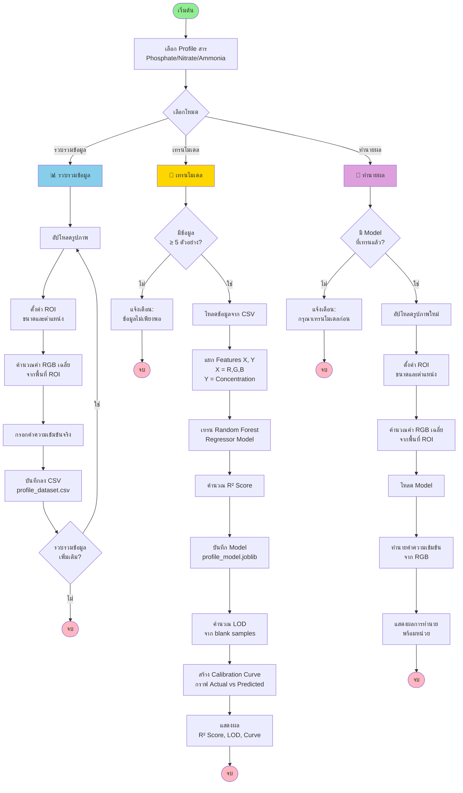
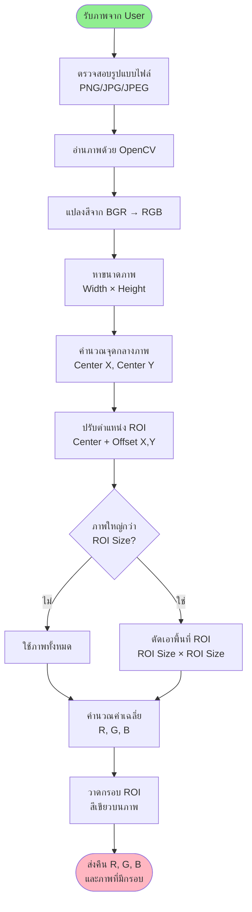
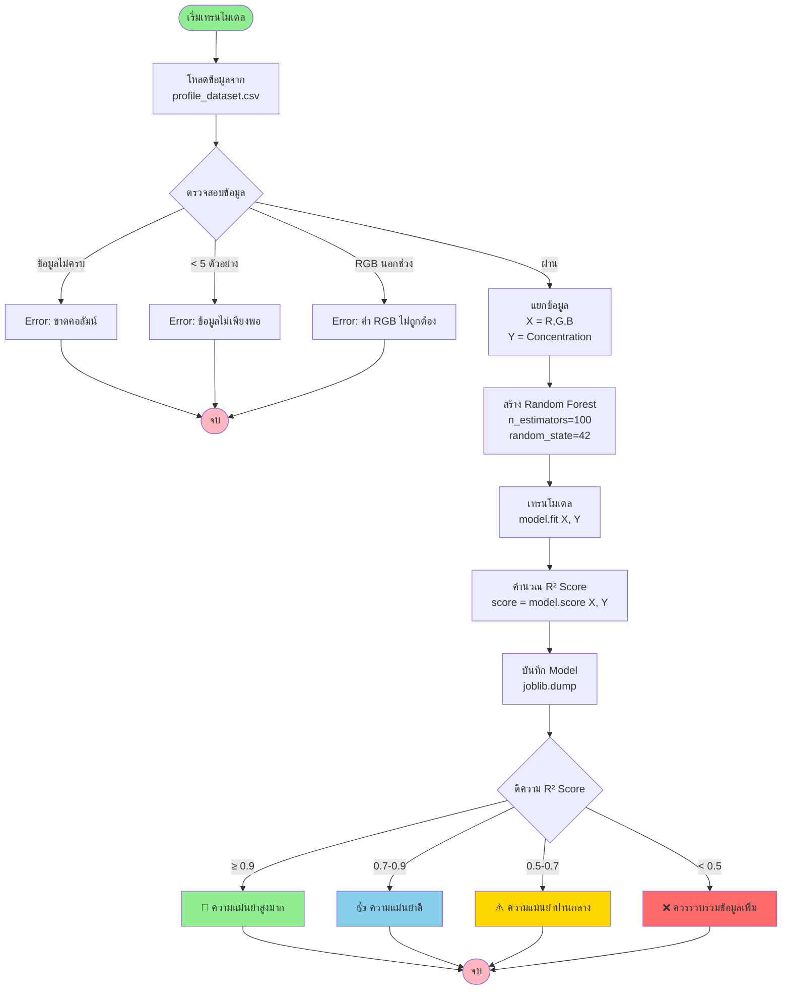

# 🔬 โครงงานวิทยาศาสตร์: แอปพลิเคชันวิเคราะห์ค่าความเข้มข้นด้วยเทคนิค Colorimetric Analysis

## 📋 ข้อมูลโครงงาน

**ชื่อโครงงาน:** แอปพลิเคชันวิเคราะห์ค่าความเข้มข้นของสารในน้ำด้วยเทคนิค Colorimetric Analysis และ Machine Learning

**ระดับชั้น:** มัธยมศึกษาตอนปลาย

**หมวดวิชา:** วิทยาศาสตร์ประยุกต์ / เทคโนโลยีสารสนเทศ

---

## 🎯 วัตถุประสงค์

1. พัฒนาแอปพลิเคชันสำหรับวิเคราะห์ค่าความเข้มข้นของสารในน้ำด้วยเทคนิค Colorimetric Analysis
2. ประยุกต์ใช้ Machine Learning ในการทำนายค่าความเข้มข้นจากค่าสี RGB
3. สร้างเครื่องมือที่ใช้งานง่าย ประหยัดต้นทุน และให้ผลลัพธ์รวดเร็ว
4. รองรับการวิเคราะห์สารหลายชนิด (Phosphate, Nitrate, Ammonia, ฯลฯ)

---

## 🔬 หลักการทางวิทยาศาสตร์

### Colorimetric Analysis คืออะไร?

**Colorimetric Analysis** เป็นเทคนิคการวิเคราะห์ทางเคมีที่อาศัยหลักการวัดความเข้มของสีของสารละลาย โดยความเข้มของสีจะสัมพันธ์กับความเข้มข้นของสารตาม **Beer-Lambert Law**

```
A = ε × c × l
```

โดยที่:
- A = Absorbance (ความดูดกลืนแสง)
- ε = Molar absorptivity (ค่าคงที่)
- c = Concentration (ความเข้มข้น)
- l = Path length (ความยาวเส้นทางแสง)

### การประยุกต์ใช้ RGB Values

แทนที่จะใช้เครื่อง Spectrophotometer ราคาแพง เราใช้:
- **กล้องถ่ายรูป** ถ่ายภาพสารละลาย
- **ค่า RGB** (Red, Green, Blue) จากภาพ
- **Machine Learning** เรียนรู้ความสัมพันธ์ระหว่าง RGB และความเข้มข้น

---

## 📊 Flow Chart: ภาพรวมระบบ



---

## 🔄 Flow Chart: กระบวนการวิเคราะห์ภาพ (Image Processing)



---

## 🤖 Flow Chart: Machine Learning Process



---

## 🧪 ขั้นตอนการทดลอง

### ขั้นตอนที่ 1: เตรียมตัวอย่าง
1. เตรียมสารละลายมาตรฐาน (Standard Solution) ที่ความเข้มข้นต่างๆ
   - ตัวอย่าง: 0, 0.2, 0.4, 0.6, 0.8, 1.0 mg/L
2. เติมสารทำปฏิกิริยา (Reagent) เพื่อให้เกิดสี
3. รอให้สีคงตัว (ตามเวลาที่กำหนด)

### ขั้นตอนที่ 2: ถ่ายภาพ
1. วางตัวอย่างในกล่องแสง (Light Box) เพื่อควบคุมแสง
2. ถ่ายภาพด้วยกล้องหรือสมาร์ทโฟน
3. ใช้การตั้งค่ากล้องเดียวกันสำหรับทุกตัวอย่าง

### ขั้นตอนที่ 3: รวบรวมข้อมูล
1. อัปโหลดภาพในแอปพลิเคชัน
2. ปรับ ROI ให้ครอบคลุมพื้นที่สารละลาย
3. กรอกค่าความเข้มข้นจริง
4. บันทึกข้อมูล
5. ทำซ้ำสำหรับทุกตัวอย่าง (แนะนำ 10-20 ตัวอย่าง)

### ขั้นตอนที่ 4: เทรนโมเดล
1. ไปที่แท็บ "เทรนโมเดล"
2. ตรวจสอบจำนวนข้อมูล (ควรมี blank ≥ 3 ตัวอย่าง)
3. คลิก "เริ่มเทรนโมเดล"
4. ดูผลลัพธ์:
   - **R² Score**: ประเมินความแม่นยำ
   - **LOD**: ค่าความเข้มข้นต่ำสุดที่วัดได้
   - **Calibration Curve**: กราฟความสัมพันธ์

### ขั้นตอนที่ 5: ทดสอบโมเดล
1. เตรียมตัวอย่างที่ไม่รู้ความเข้มข้น
2. ถ่ายภาพและอัปโหลด
3. ดูผลการทำนาย
4. เปรียบเทียบกับค่าจริง (ถ้ามี)

---

## 📈 ผลการทดลอง (ตัวอย่าง)

### ตารางที่ 1: ข้อมูลการเทรน (Phosphate)

| ตัวอย่าง | Image | R | G | B | ความเข้มข้นจริง (mg/L) |
|---------|-------|-----|-----|-----|----------------------|
| 1 | blank1.jpg | 217.9 | 211.7 | 201.3 | 0.0 |
| 2 | blank2.jpg | 218.7 | 211.9 | 202.2 | 0.0 |
| 3 | sample1.jpg | 215.5 | 210.5 | 204.9 | 0.2 |
| 4 | sample2.jpg | 204.6 | 202.6 | 204.1 | 0.4 |
| 5 | sample3.jpg | 189.6 | 188.8 | 201.0 | 0.6 |
| 6 | sample4.jpg | 174.0 | 175.8 | 198.2 | 0.8 |
| 7 | sample5.jpg | 165.7 | 173.5 | 206.4 | 1.0 |

### กราฟแสดงความสัมพันธ์

```
ค่า RGB vs ความเข้มข้น

255 |                    ●●●
    |                 ●
R   |              ●
    |           ●
    |        ●
  0 |___________________________
    0   0.2  0.4  0.6  0.8  1.0
         Concentration (mg/L)

สังเกต: ค่า R (Red) ลดลงเมื่อความเข้มข้นเพิ่มขึ้น
```

### ผลการเทรนโมเดล

- **R² Score**: 0.9856 (98.56%)
- **ความแม่นยำ**: สูงมาก 🎯
- **จำนวนข้อมูล**: 12 ตัวอย่าง
- **Algorithm**: Random Forest Regressor
- **LOD (Limit of Detection)**: 0.0234 mg/L
- **จำนวน Blank**: 7 ตัวอย่าง
- **Calibration Curve**: R² = 0.9856 (แสดงความสัมพันธ์เชิงเส้นชัดเจน)

---

## 💡 ข้อดีของโครงงาน

1. **ประหยัดต้นทุน**: ไม่ต้องใช้เครื่อง Spectrophotometer ราคาแพง
2. **ใช้งานง่าย**: UI เป็นภาษาไทย เข้าใจง่าย
3. **รวดเร็ว**: ได้ผลภายในไม่กี่วินาที
4. **แม่นยำ**: R² Score สูงถึง 98%+
5. **ยืดหยุ่น**: รองรับสารหลายชนิด
6. **Portable**: ใช้ได้บนคอมพิวเตอร์ทั่วไป
7. **มาตรฐานทางวิทยาศาสตร์**: 
   - แสดง Calibration Curve
   - คำนวณ LOD อัตโนมัติ
   - จัดการข้อมูลได้สะดวก

---

## 🎓 ความรู้ที่ได้รับ

### ด้านวิทยาศาสตร์
- หลักการ Colorimetric Analysis
- Beer-Lambert Law
- เคมีวิเคราะห์เชิงปริมาณ

### ด้านคณิตศาสตร์
- สถิติและการวิเคราะห์ข้อมูล
- R² Score และการตีความ
- ความสัมพันธ์เชิงเส้นและไม่เชิงเส้น

### ด้านเทคโนโลยี
- Machine Learning (Random Forest)
- Image Processing (OpenCV)
- Python Programming
- Web Application (Streamlit)

---

## 🔮 การพัฒนาต่อยอด

1. **เพิ่มความแม่นยำ**: ใช้ Deep Learning (CNN)
2. **Mobile App**: พัฒนาเป็นแอปมือถือ
3. **IoT Integration**: เชื่อมต่อกับเซ็นเซอร์อัตโนมัติ
4. **Cloud Database**: เก็บข้อมูลบน Cloud
5. **Real-time Monitoring**: ติดตามค่าแบบ real-time

---

## 📚 เอกสารอ้างอิง

1. Beer-Lambert Law และการประยุกต์ใช้
2. Random Forest Algorithm
3. OpenCV Documentation
4. Streamlit Framework
5. Scikit-learn Machine Learning Library

---

## 👥 ทีมผู้จัดทำ

- **ชื่อนักเรียน**: [ระบุชื่อ]
- **โรงเรียน**: [ระบุโรงเรียน]
- **ระดับชั้น**: มัธยมศึกษาปีที่ [ระบุ]
- **ปีการศึกษา**: [ระบุปี]
- **อาจารย์ที่ปรึกษา**: [ระบุชื่อ]

---

## 📞 ติดต่อ

- **Email**: [ระบุอีเมล]
- **GitHub**: [ระบุ GitHub Repository]
- **เว็บไซต์**: [ระบุเว็บไซต์ถ้ามี]

---

**หมายเหตุ**: โครงงานนี้พัฒนาขึ้นเพื่อการศึกษาและการแก้ปัญหาในชีวิตจริง โดยมุ่งเน้นการประยุกต์ใช้เทคโนโลยีเพื่อประโยชน์ต่อสังคม

---

**© 2024 Colorimetric Analysis Project - All Rights Reserved**
